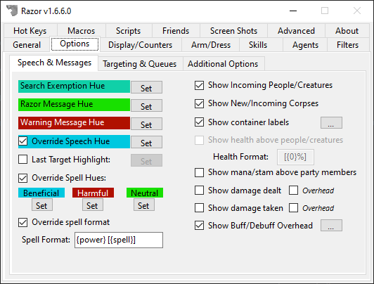
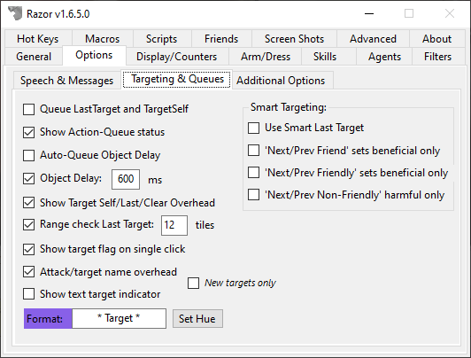
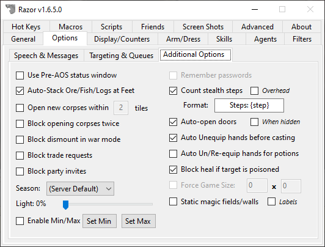

# Options

## Speech & Messages

* **Search Exemption Hue**
    - Used in conjunction with the **AutoSearchExemption** feature on the agents tab. Containers and/or container types added to this agent will appear the *Search Exemption Hue* while in your backpack. Click the set tab to the right to change the color.

!!! note
    The color of the item does not actually change. When removed from your backpack it will return to the original color.

* **Razor Message Hue**
    - Razor messages sent to your client will be this color. Click the set tab to change the color.
* **Warning Message Hue**
    - Razor messages sent to your client specifically to warn you of something, like low reagents, will be this color. Click the set tab to change the color.
* **Override Speech Hue**
    - Check this box to force all speech on your screen to be one color. Click the set tab to select the color.
* **Last Target Highlight**
    - When checked, the last target will highlight the selected color. Click the set tab to select the highlight hue.
* **Override Spell Hues**
    - Like speech, checking this box allows you to select the color for spell text, both words of power or spell names. Colors may be selected for beneficial, harmful, and neutral spells.
* **Override Spell Format**
    - If checked, Razor will transform spell power words into the actual spell name.
* **Spell Format**
    - This field determines how you view spells being cast.
        - `{power}` will show words of power on your screen. These are the actual spell words.
        - `{name}` or `{spell}` will show the spell name.
        - `{circle}` will show the circle of the spell.
* **Show buff/debuff overhead**
    - Check this option if you want to see when a buff/debuff has been added/removed from your character (ie: `[+Magic Reflection]` or `[+Reactive Armor]`).
    - **Default Buff/Debuff Format** `[{action}{name}]`
        - `{action}` will be a `+` or `-` symbol indicating if it was added or removed.
        - `{name}` will be the official name of the buff/debuff.
* **Filter Snooping Messages**
    - Filters out the messages when someone nearby is snooping that can be seen as spam.
* **Show Incoming People/Creatures**
    - This will show the names of players and creatures as they enter your screen.
    
!!! note
    This option exist within the UO client itself. It's recommend to disable the one in the UO Client or in Razor or it will produce duplicated names when new players or creatures enter the screen.*

* **Show New/Incoming Corpses**
    - As above, but with corpses.

* **Show container labels**
    - This option will allow you to tag containers and give them a label. This should allow for easier pixel sorting.
    - **Default Format** `[{label}] ({name})`
* **Show health above people/creatures**
    - Check this option to show changes in player's health with a text percentage over their heads. The numbers will show in blue - green at 100%, to yellow at 50%, to purple - red at 0%.
    - **Default Health Format** - `[{0%}]` or `[NN%]`
* **Show mana/stam above party members**
    - As above, but mana and stamina.
* **Show damage dealt**
    - Display the damage you've dealt in the lower-left or overhead.
* **Show damage taken**
    - Display the damage you're taking in the lower-left or overhead.

## Targeting & Queues

* **Queue LastTarget and TargetSelf**
    - This is used with **Last Target** and/or **Target Self** hotkeys. When this option is selected, `Last Target` and `Target Self` commands will be placed in queue until they can be executed. For example, you cast a spell and hit the `Last Target Hotkey` too soon. The moment the target is up, the last target function will be executed. A hotkey can be set to clear the queue when needed.
* **Show Action-Queue status messages**
    - A toggle to turn off/on messages about actions being queued. Unchecking this option will still allow some important messages to come through.
* **Auto-Queue Object Delay actions**
    - When checked, Razor will automatically queue up your double-clicks. It will prevents the message "You must wait to perform another action". This is an important setting for a well-run macro. The object delay field below should reflect your specific connection. Set the object delay at your average ping to the server + 500 (approx)
* **Object Delay**
    - Sets the number of milliseconds between actions. Unchecking the box will set it to 0.
* **Show Target Self/Last/Clear Overhead**
    - When checked, the messages for `[Target Self]`, `[Last Target]` and `[Clear Target Queue]` will display overhead instead of in the lower-left corner.
* **Range check Last Target: *X* tiles**
    - This option will have Razor check that last target is within range. If it's not, Razor sends a warning message and your target is not cancelled out. Last Target can be selected to try again without having to bring the cursor up a second time.  Select the number of tiles, within game allowances.
* **Show target flag on single click**
    - Select to display a text flag over last targets; to be used with Smart Target option. Flags show as `[Current Target]`, `[Beneficial Target]`, or `[Harmful Target]`.

!!! tip
    To edit this format, go into your profile and search for `PartyStatFmt`. `[{0}% / {1}%]` is the standard format.*

* **Attack/target name overhead**
    - When you attack a target, or aquire a new target using a hotkey, it will display the name of your target above your head.
* **Show text target indicator**
    - When checked, a simple text indicator above the target's head will appear

### Smart Targeting

Smart Targeting enables Razor to use beneficial or harmful spells according to your previous actions.

For example, in battle if you cast Energy Bolt (a harmful spell) at an enemy and Greater Heal (a beneficial spell) at a friend, Razor will remember the last targets for each spell type. The next time you cast a harmful spell with `Last Target`, Razor will target the enemy even if you just casted Greater Heal on your friend with last target without requiring you to set a new target.

!!! tip "Smart Targeting Hot Keys"
    You can set your `Harmful` and `Beneficial` target manually by using `Set Last Target (Beneficial)` or `Set Last Target (Harmful)`.
 
* **Use smart last target**
    - Enables smart targeting
* **'Next/Prev Friend' sets beneficial only**
    - Using Next/Prev Friend will only set the beneficial target (this option works in conjunction with the [Friends tab](friends.md))
* **'Next/Prev Friendly' sets beneficial only**
    - Using Next/Prev Friendly will only set the beneficial target.
* **'Next/Prev Non-Friendly' harmful only**
    - Using Next/Prev Friendly will only set the harmful target.

## Additional Options

* **Use Pre-AOS status window**
    - The default status window is from the AOS expansion. If you check this box, it will look like the Pre-AOS window.
    
!!! tip
    You will need to close, then re-open your status bar in-game for the change to take effect.*

* **Auto-Stack Ore/Fish/Logs at Feet**
    - When checked, when these items are placed into your bag, they will stack at your feet instead. Useful for gathering resources.
* **Open new corpses within *X* tiles**
    - This option automatically opens new corpses within the selected number of tiles.

!!! tip
    Use with caution, this function does not differentiate between a blue, grey, or red corpse.

* **Block opening corpses twice**
    - Used with the above option, if checked a corpse that was auto-opened will not auto-open again. Manually opening a corpse does not prevent it from auto-opening.
* **Block Dismount in War Mode**
    - Double-clicking yourself will dismount from any ride you may be on. This selection will cause Razor to block dismount while you are in war mode, preventing accidental dismount.
* **Block trade requests**
    - When checked, any trade request initiated by another person will be auto-blocked.
* **Block party invites**
    - When checked, this will block all party invites automatically.
* **Season**
    - Set the season in the client.
* **Light**
    - Adjust the slider to set the **Light Level** on the client. To keep this setting, be sure **Light Filter** is checked on the **General** tab.
* **Enable Min/Max**
    - This feature lets you set the min and max light levels that Razor will allow.
* **Remember passwords**
    - Using this option will save your passwords in your Profile.xml file. When logging in the saved password will be entered for you although the field will remain blank on your screen.
    
!!! warning
    Anyone who obtains a copy of your profile maybe be able to decrypt your password and log into your account.

* **Count stealth steps**
    - Keeps track of steps taken while hidden, displaying the number on the bottom left of your screen unless you check **Overhead** and they will display over your character.
* **Automatically open doors**
    - This option will auto-opens a door every time you walk up to, or turn to face, the door.
* **Auto Unequip hands before casting**
    - Removes weapons from your hands automatically when you cast a spell, delaying the spell until it can be cast.
* **Auto Un/Re-equip hands for potions**
    - The same as above but for using potions. Once the potion is used, the item is returned to your hand.
* **Block heal if target is poisoned**
    - This prevents the cast of a wasted heal on a poisoned target.
* **Force Game Size**
    - Set your game window to the size you want. Once you have entered the size, it needs to be applied. Open options in-game (ALT+O or use the tab from the paperdoll) and click **Apply**. The game window size will be applied and remembered.
* **Static magic fields/walls**
    - This option will replace the field spells with static colored tiles. Checking labels will also show the name of the field.
